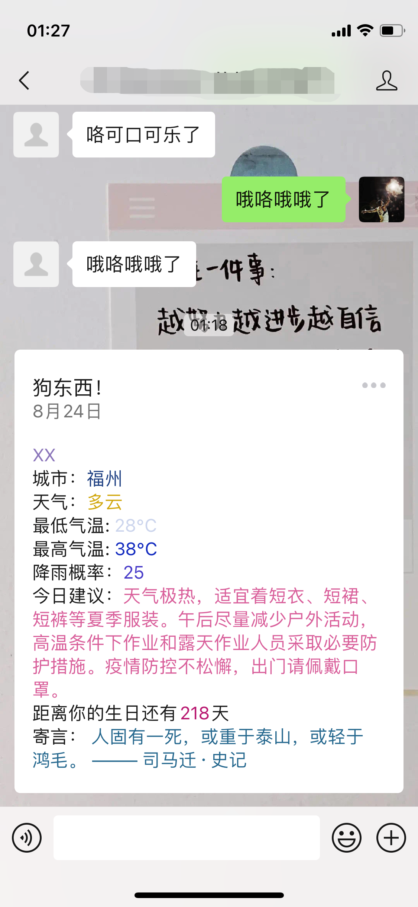
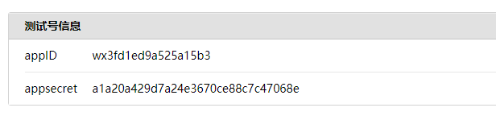
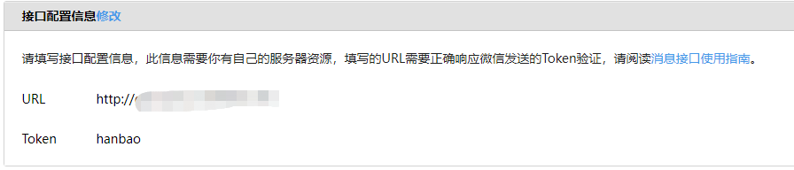
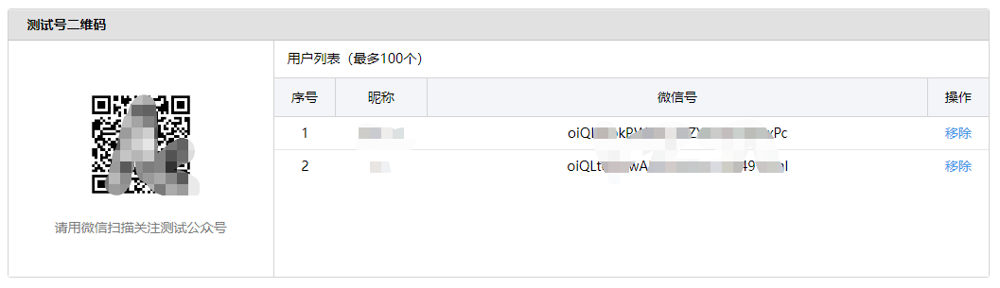
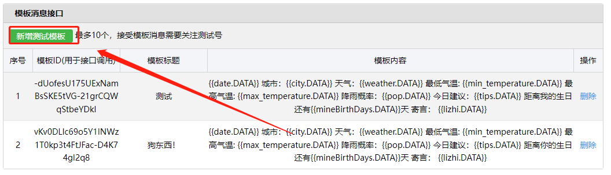
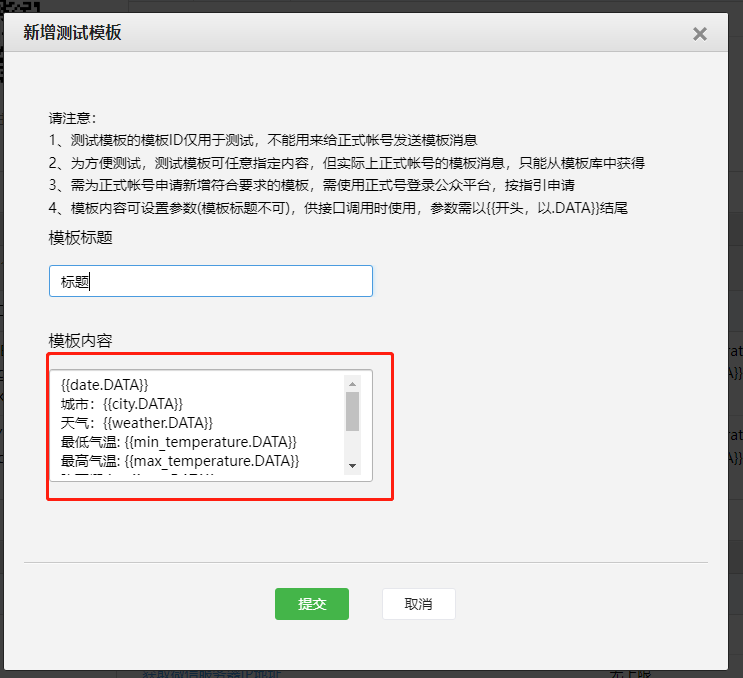
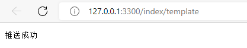
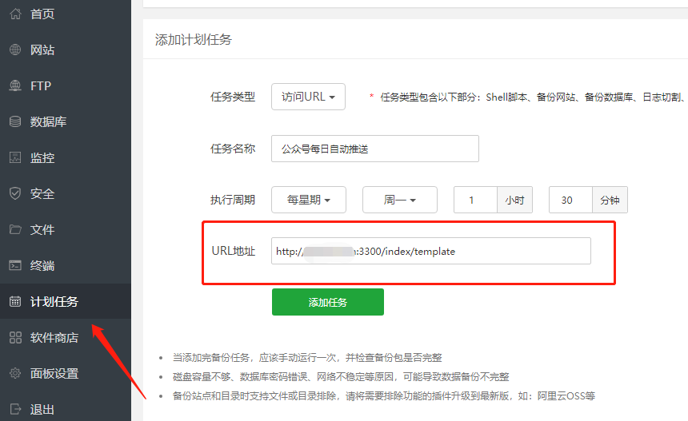

# 微信公众号推送(Node.js版)
 这个原项目是用py写的。[原项目](https://github.com/erwanjun/weixin_tuisong)
>## 效果


>## 安装运行
打开cmd，执行以下命令
```bash
#前提是需要有node环境，没有可以百度一下怎么安装

node app.js   #启动项目 默认3300端口"
npm i #安装依赖"
```
#### 功能
- [✓] 手动公众号消息推送
- [✓] 你发什么消息，公众号回复什么（目前只支持文本消息）
#### 信息配置
```javascript
// 信息配置在utils/config.js
// 公众号配置 （这个是我的配置信息）
//配置文件
module.exports = {
  wx: {
    token: "hanbao",
    appId: "wx3fd1ed9a525a15b3",
    appsecret: "a1a20a429d7a24e3670ce88c7c47068e",
    //模板id
    template_id: "vKv0DLlc69o5Y1INWz1T0kp3t4FtJFac-D4K74gI2q8",
  },
  // 要推送的用户openid和信息 （只推送给她）
  users: {
    openid: "oiQLt6okPWNC_0aZY4wqUxjP4xPc",
    city: "福州市", //支持国内城市行政区划代码（建议）和城市中文名称查询（市区县）
    // 生日
    month: "03", //月
    day: "30", //日
  },

  // 天行api 的APIKEY（官网自己申请）
  tianXin: {
    key: "452bfeff2c5da4f60ce1417ce624f666",
  },
};
```
>## 公众号配置

前置条件

注册一个微信公众号，利用下面的链接注册一个微信公众测试号

https://mp.weixin.qq.com/debug/cgi-bin/sandbox?t=sandbox/login

扫码登录成功后，就可以生成微信公众测试号的appID和appsecret这两串数字需要记住，后面会用到



<p style="color: #f34250;">注意: 只有启用服务端才可以配置这里, 另外域名换成你自己的域名，即http://www.xxxx.com/access</p>
<p style="color: #f34250;">不配置回复功能不能用</p>


扫描测试号二维码后会生成微信号 <span style="color: #f34250;">(这个就是：openid）</span>，哪个账号需要接收推送信息就需要哪个账号扫码（记得修改配置文件）




模板


在config.txt里面（可以自行更改，要和代码里的一样）

```
{{date.DATA}} 
城市：{{city.DATA}} 
天气：{{weather.DATA}} 
最低气温: {{min_temperature.DATA}} 
最高气温: {{max_temperature.DATA}} 
降雨概率：{{pop.DATA}} 
今日建议：{{tips.DATA}} 
距离你的生日还有{{mineBirthDays.DATA}}天 
寄言： {{lizhi.DATA}}
```




>## 关于推送
+ 手动推送：调用接口推送，访问url ，实现手动推送 （本地也可以直接推送）


+ 每天自动推送：办法很多，原理是就是模拟手动推送，我用的宝塔里面的定时计划。



>## 最后
功能不多，部署简单，可以自行修改，不懂的可以问我 wx：```lcf_0507```
<p >一个前端菜鸡（找工作中） </p>
<p >ps：有没有老板招前端的，麻烦收留我 555555</p>


